# Отчет по лабораторной работе

**Студент:** Шаменков Максим Александрович 6413

## Среда выполнения
| Параметр | Значение |
|----------|----------|
| **Гипервизор** | VMware |
| **Образ Ubuntu Server** | 24.04.4 LTS |
| **Клиентская ОС** | Ubuntu Live Server |
| **Имя пользователя** | shamenkov |

---

## Задание 1. Развёртывание ВМ и подключение дисков

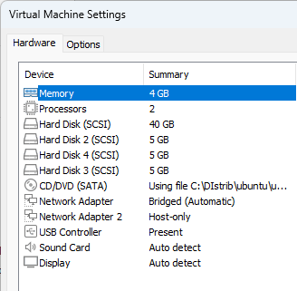

## Задание 2. Настройка ssh по ключу

### Уже настроено в лабе 1
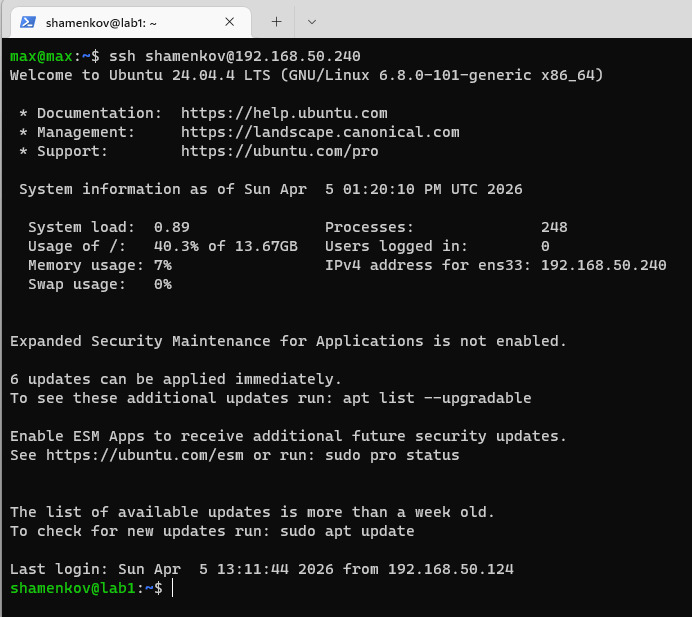

## Задание 3. Настройка сети через netplan
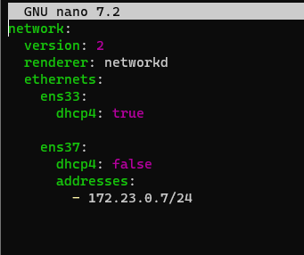

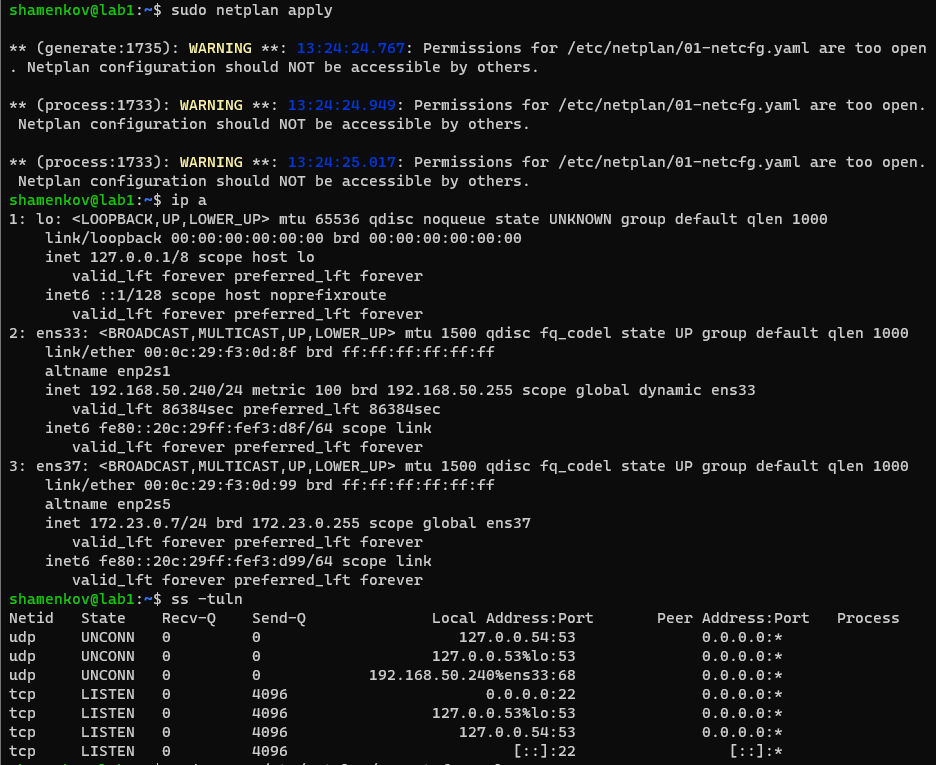

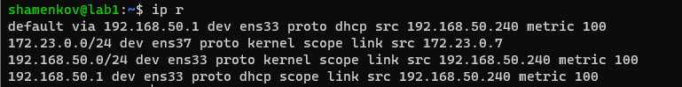

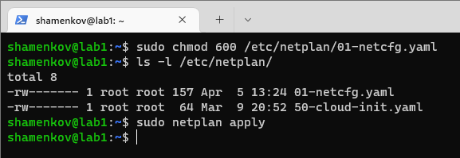

## Задание 4. Изучение конфигурации дискового пространства виртуальной машины

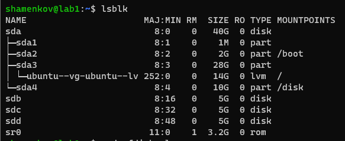

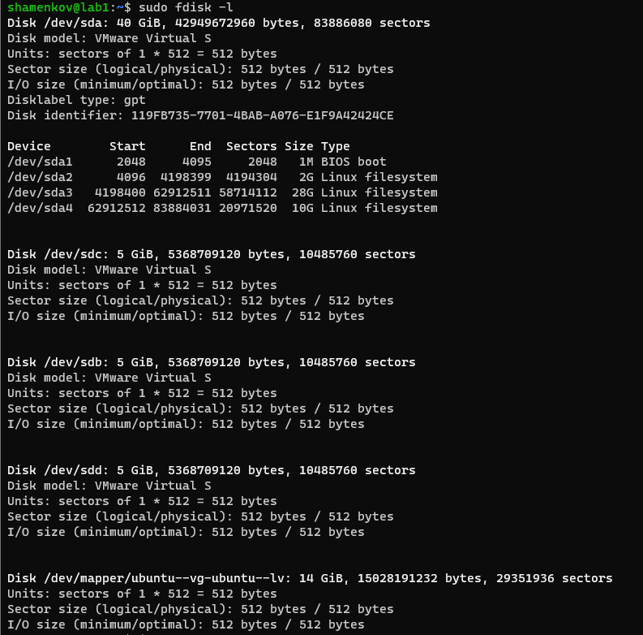

## Задание 5. Объединение свободные неразмеченные диски ВМ в RAID-массив 5-го уровня

### Очистка дисков
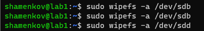

### Создание RAID 5
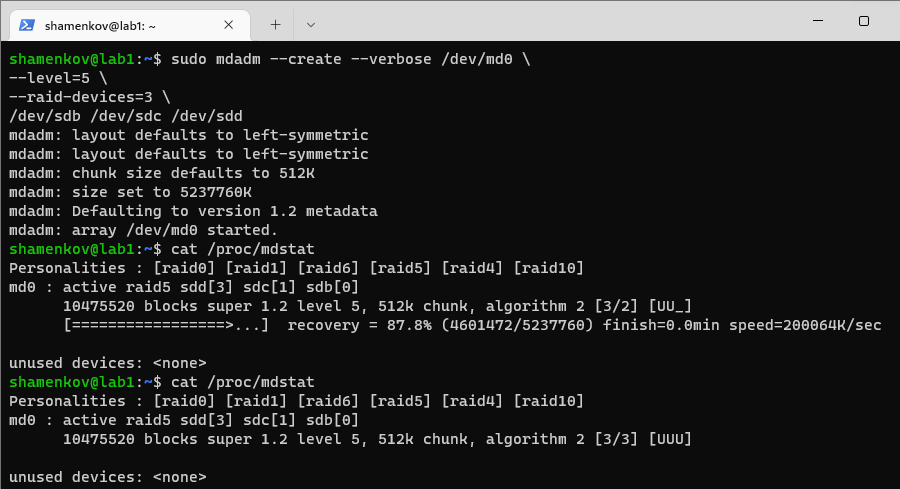

### Проверка 
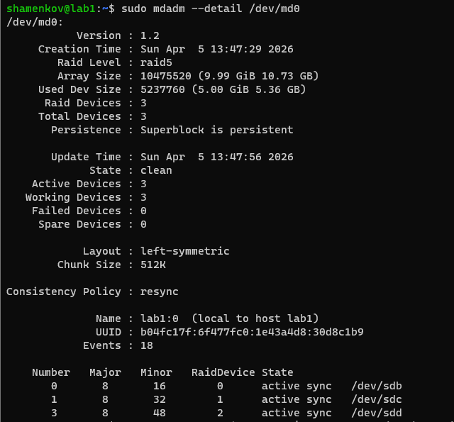

### Сохранение RAID
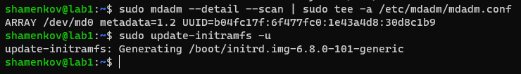

## Задание 6. LVM и постоянное монтирование в /raid/0
### Создать Physical Volume (PV)
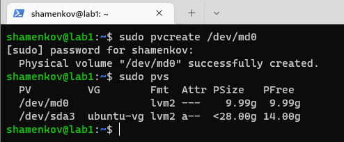

### Создать Volume Group (VG)
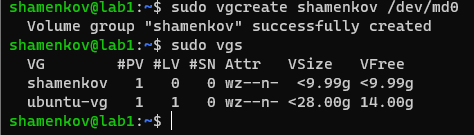

### Создать Logical Volume (LV)
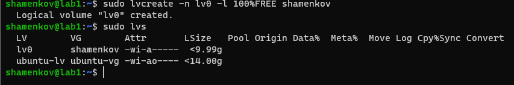

### Создать файловую систему
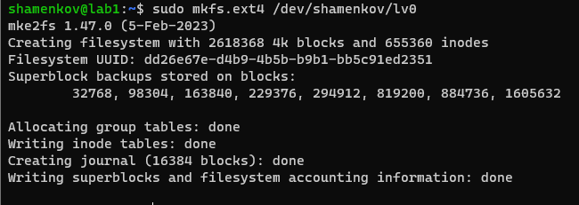

### Создать точку монтирования и смонтировать
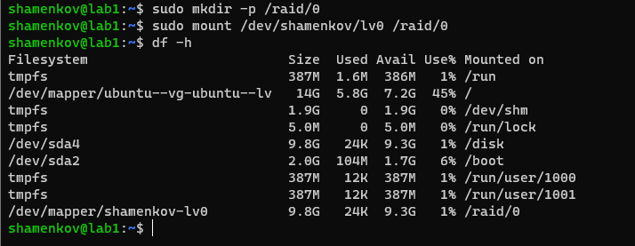

### Делаем постоянно монтирование

#### Узнаем uuid
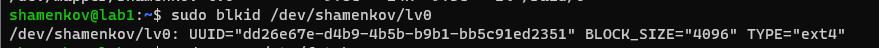

#### Сделали запис в файле sudo nano /etc/fstab
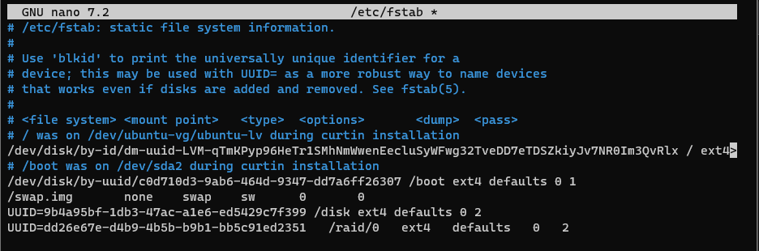

#### Монтируем и проверяем
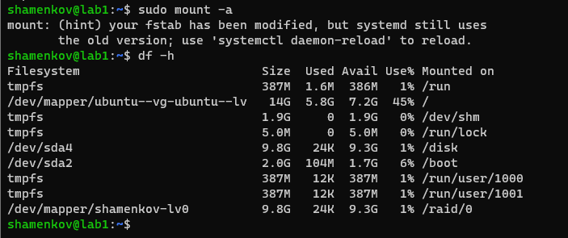


## Задание 7. Средствами менеджера виртуальных машин добавить к ВМ новый диск; добавить диск в RAID-массив и в LVM

### Состояние перед добавлением нового диска
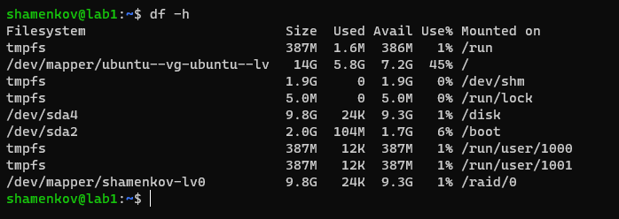

### Добавляем новый виртуальный диск
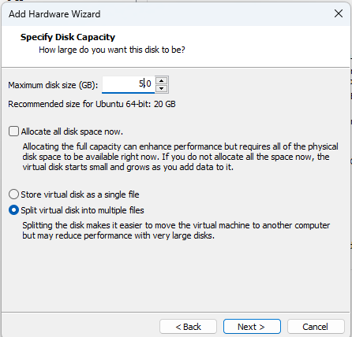
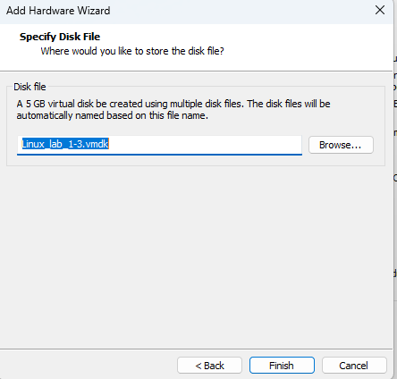
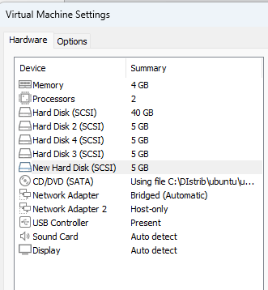

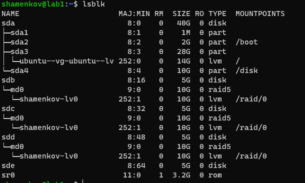

### Очищаем диск
```bash
sudo wipefs -a /dev/sde
```

### Добавляем в raid
```bash
sudo mdadm --add /dev/md0 /dev/sde
```
### Увеличиваем Raid
```bash
sudo mdadm --grow /dev/md0 --raid-devices=4
```

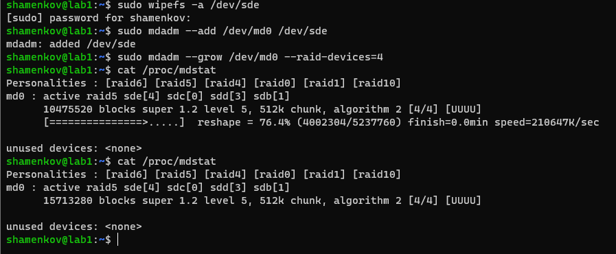

### Расширяем LVM

#### Обновляем PV
```bash
sudo pvresize /dev/md0
```

#### Расширяем LV
```bash
sudo lvextend -l +100%FREE /dev/shamenkov/lv0
```

#### Расширяем файловую систему
sudo resize2fs /dev/shamenkov/lv0

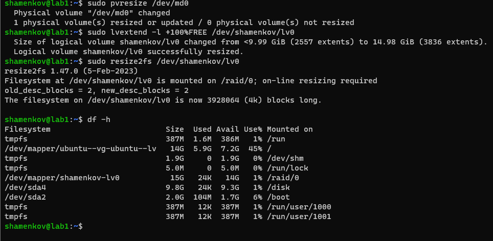


## Задание 9 — NFS

### Создать папку
sudo mkdir -p /raid/0/backup

### Настраиваем экспорт
sudo nano /etc/exports
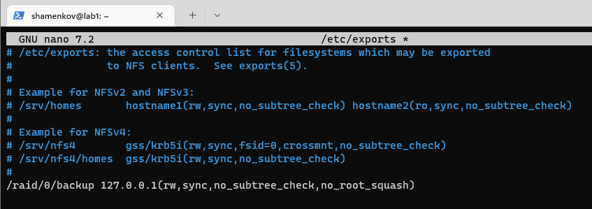

### Применяем конфиг
sudo exportfs -rav

### Запускаем NFS + проверка
sudo systemctl enable --now nfs-kernel-server

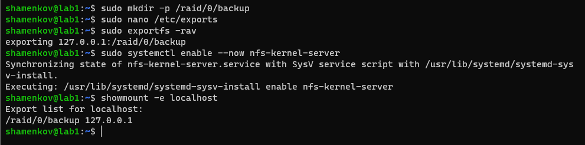

### Создаем точку монтирования
sudo mkdir -p /mnt/nfs_test

### Смонтируем
sudo mount -t nfs 127.0.0.1:/raid/0/backup /mnt/nfs_test
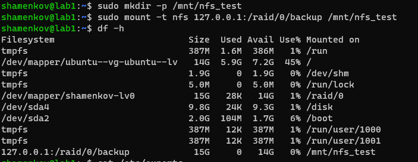


### Проверка 
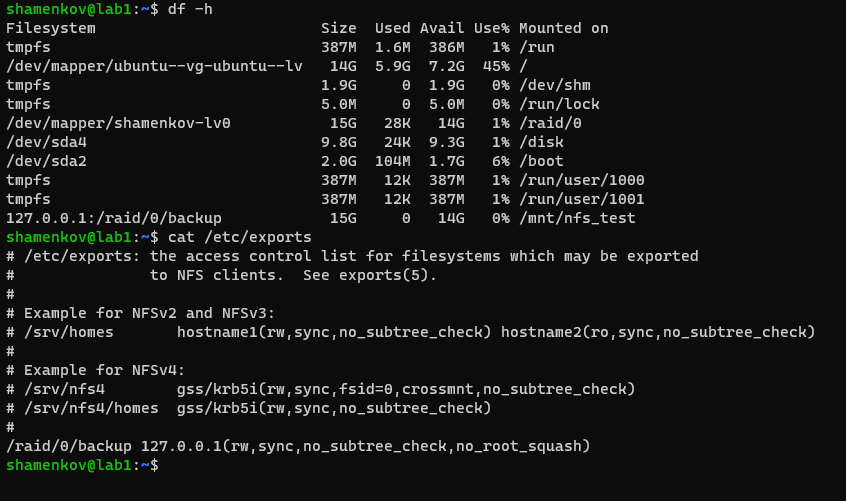

все работает в df -h 
127.0.0.1:/raid/0/backup → /mnt/nfs_test

## Задание 10 — Настроить резервное копирование содержимого домашнего каталога пользователя (/home/<user>) в каталог backup на сервере раз в 2 минуты, используя cron.

### Цель: каждые 2 минуты создается архив
/home/shamenkov → /raid/0/backup

### Создаем скрипт
sudo nano /usr/local/bin/backup.sh

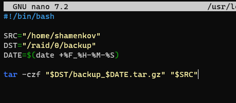

### Делаем скрипт исполняемым
sudo chmod +x /usr/local/bin/backup.sh

### Проверяем сначала вручную
sudo chmod +x /usr/local/bin/backup.sh
ls -lh /raid/0/backup

### Отлично появился файл backup_2026-04-05_15-18-07.tar.gz

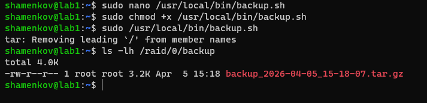

### Настраиваем cron

#### добавляем строку
*/2 * * * * /usr/local/bin/backup.sh

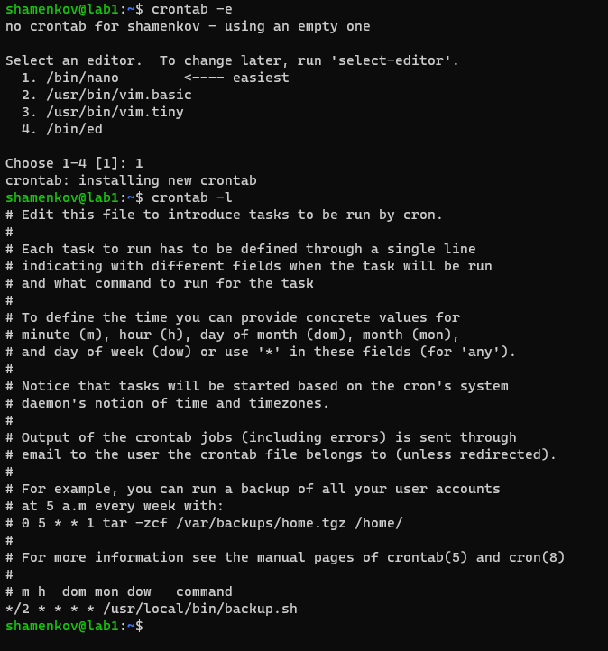

### Спустя 2 минуты проверяем результат. 
### Итог: проблема. пользователь shamenkov НЕ может писать в /raid/0/backup

### Исправляем владельца
sudo chown -R shamenkov:shamenkov /raid/0/backup

### Теперь ждем 2 минуты и проверяем 
#### Состояние до
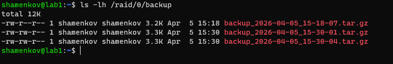

#### спустя 2 минуты

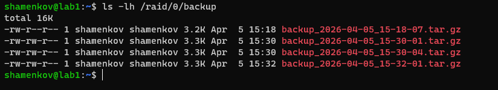


## Задание 11 — iptables

### Смотрим правила в iptables

sudo iptables -L -n -v

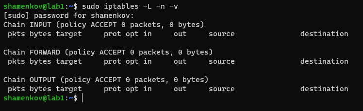

### Запрещаем icmp трафик
sudo iptables -A INPUT -p icmp -j DROP

### Проверка ping не идет 
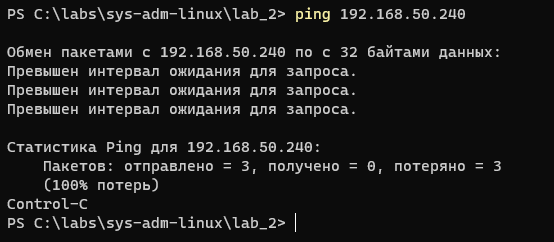


### Узнаем  ip-адрес хоста
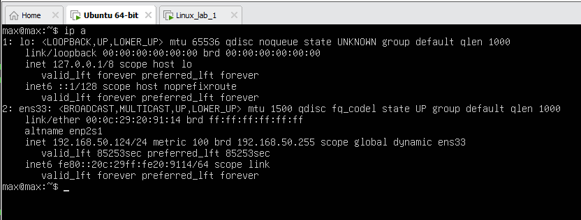

### Блокировка выбранного IP=192.168.50.124

sudo iptables -A INPUT -s 192.168.50.124 -j DROP

### Результат:
Текущая сессия ssh закрылась

### Далее заблокируем подключаения по ssh
sudo iptables -A INPUT -p tcp --dport 22 -j DROP

### Проверка
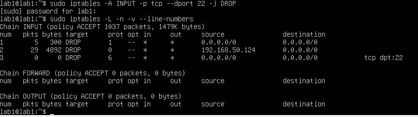


## Задание 12 — удаление правил

sudo iptables -F

### Проверка 
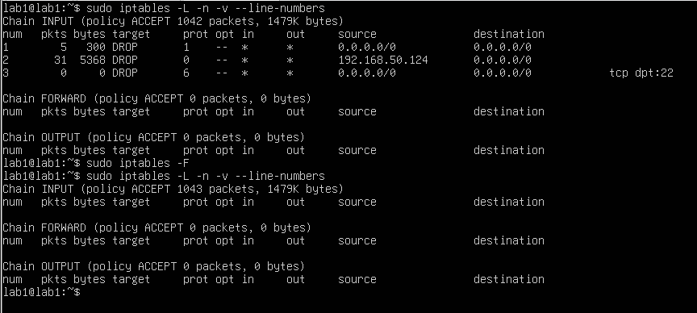

### Проверка ssh 
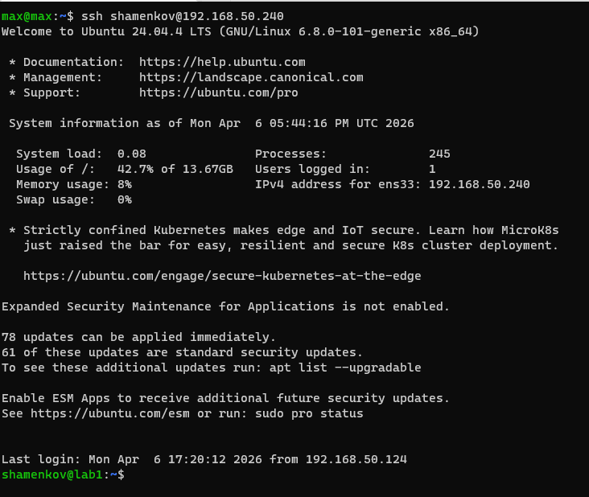

### Проверка ping
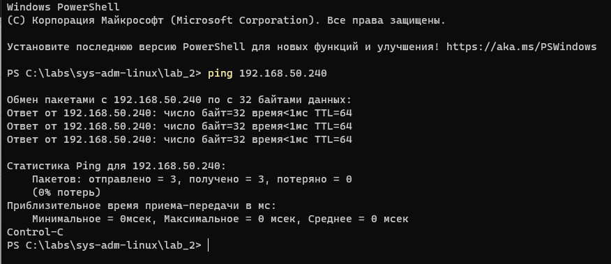

## Задание 13 — Включить брандмауэр ufw и создать те же правила блокировки.

### Включаем UFW
sudo ufw enable

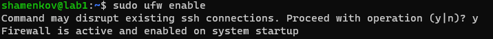


### Блокируем SSH
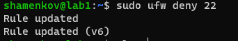

### Блокировка выбранного IP=192.168.50.124
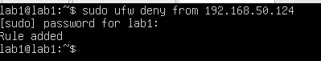

### Блокируем ping

sudo nano /etc/ufw/before.rules

#### Находим строку 
-A ufw-before-input -p icmp --icmp-type echo-request -j ACCEPT

#### Меняем на 
-A ufw-before-input -p icmp --icmp-type echo-request -j DROP

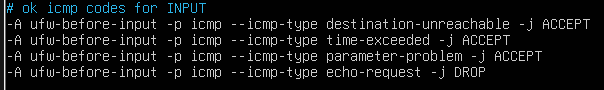

### Применим изменения
sudo ufw reload

### Проверка
sudo ufw status numbered

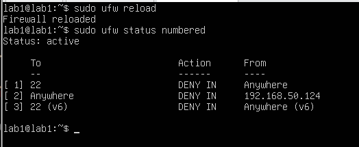

## Задание 14 — Мониторинг и диагностика: использовать ss и nc для просмотра портов и проверки доступности.

### Проверка портов через ss
ss -tuln
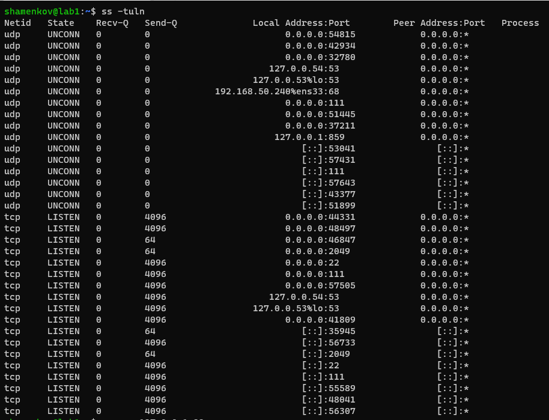

### Проверка портов через nc
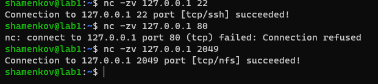


## Задание 15 — Использовать tcpdump для анализа трафика:
### Просмотр трафика
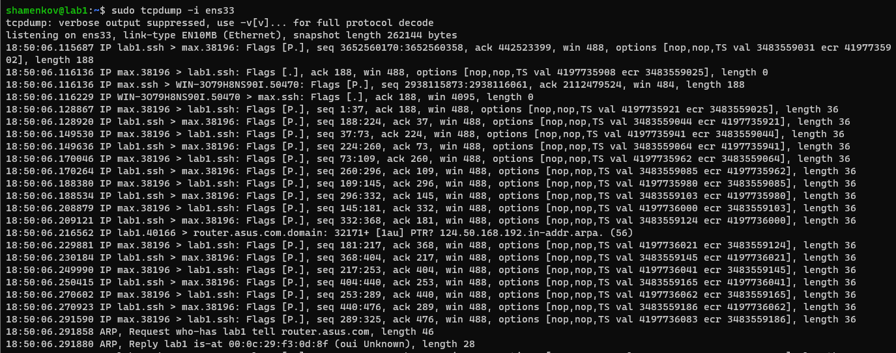

### Фильтр по порту (например SSH)
sudo tcpdump -i ens33 port 22
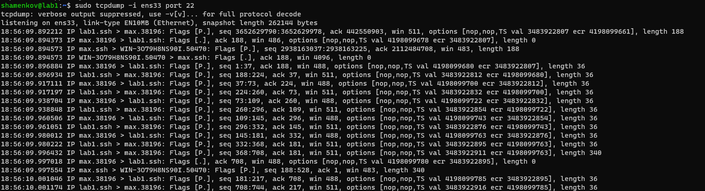

### Фильтр по ICMP (ping)
sudo tcpdump -i ens33 icmp
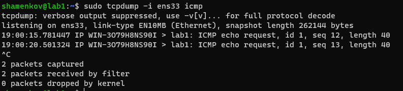

### Запись в файл
sudo tcpdump -i ens33 -w capture.pcap
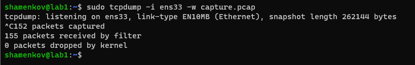
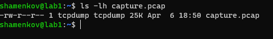

## Задание 16 — iptraf-ng

### Установка
sudo apt install iptraf-ng -y

### Запуск
sudo iptraf-ng
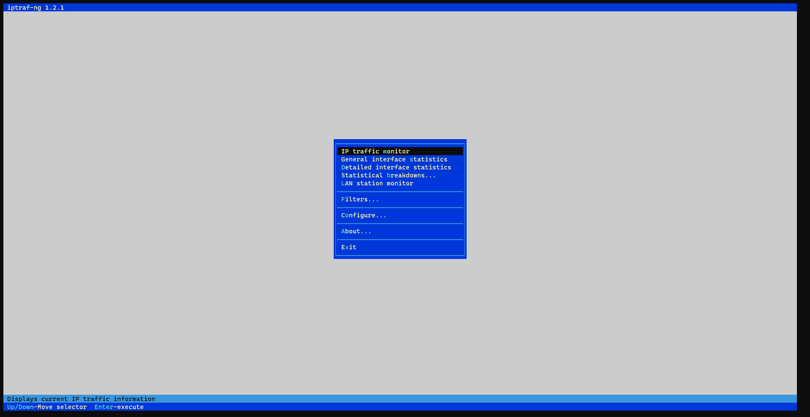

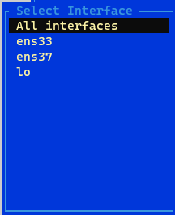

### Мониторинг
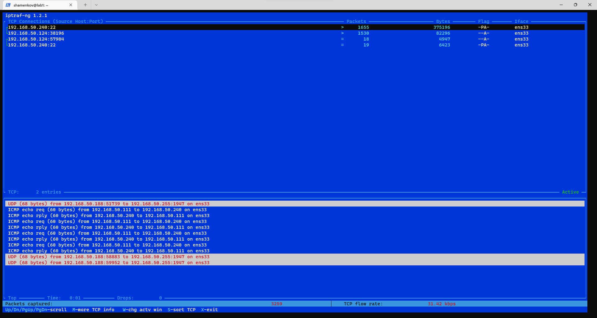

## Задание 17 — На сервере настроить дополнительный сетевой интерфейс через netplan, статический IP 172.23.0.7/24.

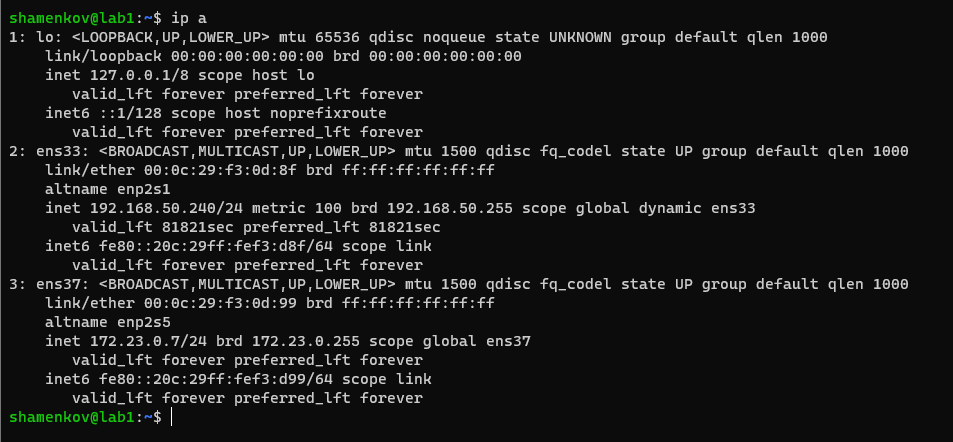

## Задание 18 — В ufw открыть порты 139 и 445. Проверить доступность портов извне виртуальной машины с помощью nc

### Открываем порты 139 и 445

sudo ufw allow 139
sudo ufw allow 445

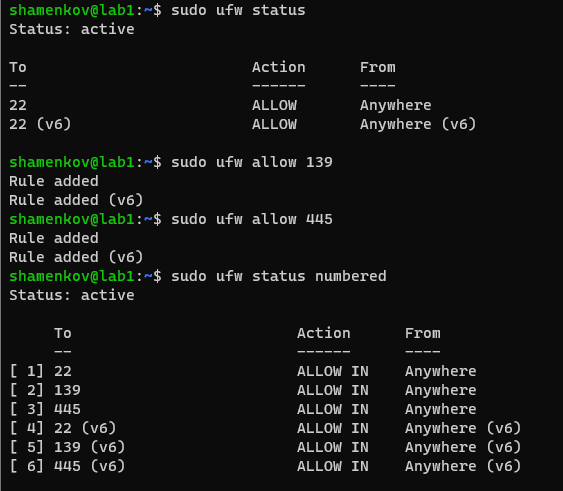

### Проерим через nc
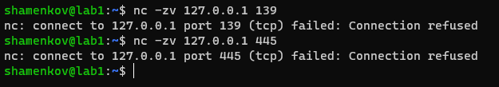

## Задание 19 — openVPN

### Установка
sudo apt install openvpn easy-rsa


### Создали инфраструктуру сертификатов (PKI)
make-cadir ~/openvpn-ca
cd ~/openvpn-ca
./easyrsa init-pki
./easyrsa build-ca

### Сгенерировали сертификаты на сервере
./easyrsa gen-req server nopass
./easyrsa sign-req server server

### Сгенерировали сертификаты на клиенте
./easyrsa gen-req client1 nopass
./easyrsa sign-req client client1

### Генерация параметров Диффи-Хеллмана
./easyrsa gen-dh

### Копирование файлов на сервер 
sudo cp pki/ca.crt /etc/openvpn/
sudo cp pki/private/server.key /etc/openvpn/
sudo cp pki/issued/server.crt /etc/openvpn/
sudo cp pki/dh.pem /etc/openvpn/

### Настройка конфиг файл server.conf
/etc/openvpn/server.conf

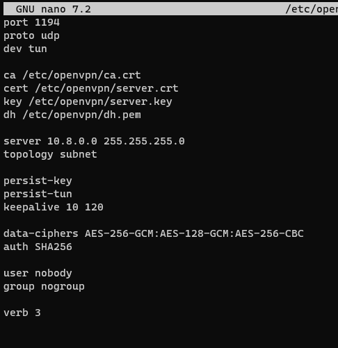

### Включение машрутизацию
net.ipv4.ip_forward=1

### Запуск сервер и провери работу
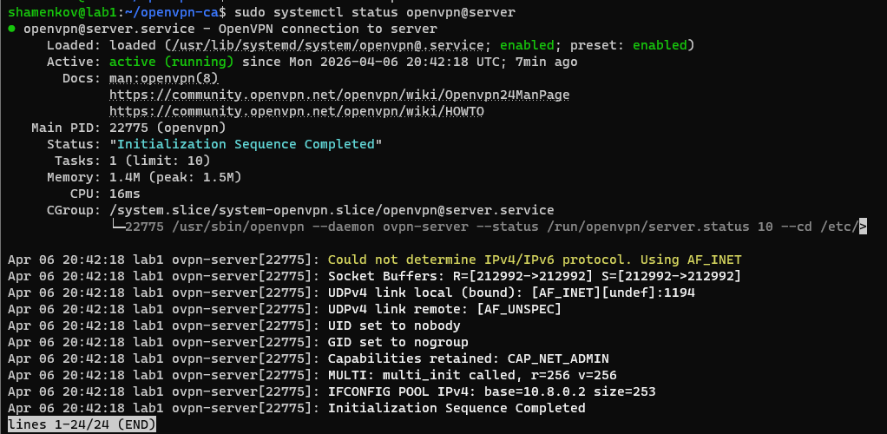

### Создание клиентский конфиг
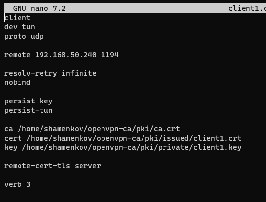

### Передача файлов на клиент 
scp shamenkov@192.168.50.240:~/openvpn-ca/pki/ca.crt .
scp shamenkov@192.168.50.240:~/openvpn-ca/pki/issued/client1.crt .
scp shamenkov@192.168.50.240:~/openvpn-ca/pki/private/client1.key .
scp shamenkov@192.168.50.240:~/openvpn-ca/client1.ovpn .

### Передачи ovpn на клиент и запуск
sudo openvpn --config client1.ovpn
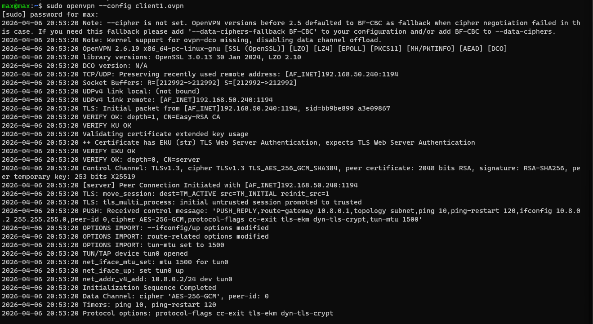


## Задание 20 — openVPN
### Установка
sudo apt install samba -y

### Создаем папку, которую будем расшаривать
sudo mkdir -p /raid/0/share

### Создаем тестовый файлик
echo "test file" | sudo tee /raid/0/share/test.txt

### Настроить права на папку
sudo chmod 777 /raid/0/share

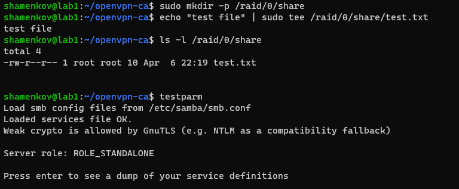


### Отредактируем конфиг samba
sudo nano /etc/samba/smb.conf

### Добавим следующий раздел
[share]
   path = /raid/0/share
   browseable = yes
   writable = yes
   guest ok = yes
   read only = no

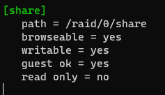


### Перезапускаем и проверяем состояние
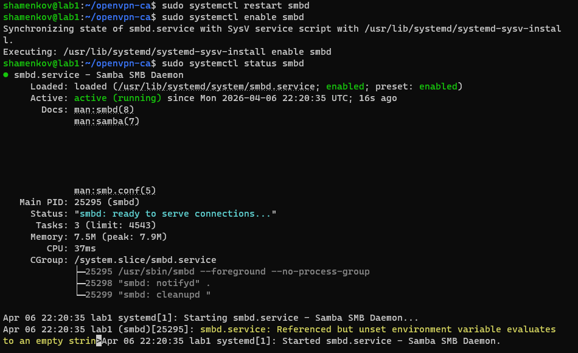

### Проверяем, что порты слушаются
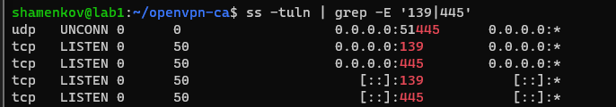

### Проверка работы smb
smbclient -L //172.23.0.7 -N
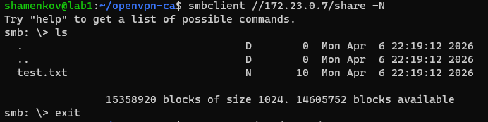

## Задание 21 — Настроить проброс портов 139 и 445 из сети 172.23.0.0/24 в VPN-сеть 10.8.0.0/24.

### Делаем проброс портов

### Проброс входящих соединений

sudo iptables -t nat -A PREROUTING -i ens33 -p tcp --dport 139 -j DNAT --to-destination 10.8.0.2:139
sudo iptables -t nat -A PREROUTING -i ens33 -p tcp --dport 445 -j DNAT --to-destination 10.8.0.2:445

### Разрешаем пересылку
sudo iptables -A FORWARD -p tcp -d 10.8.0.2 --dport 139 -j ACCEPT
sudo iptables -A FORWARD -p tcp -d 10.8.0.2 --dport 445 -j ACCEPT

### Включаем NAT
sudo iptables -t nat -A POSTROUTING -o tun0 -j MASQUERADE

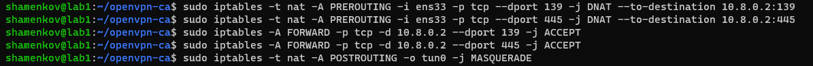

### Проверим на хосте
nc -zv 192.168.50.240 139
nc -zv 192.168.50.240 445

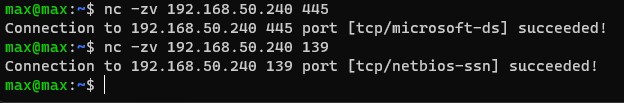


### Вывод

В ходе лабораторной работы была выполнена настройка различных сетевых сервисов в Linux. Были изучены и реализованы:

- технологии **RAID** и **LVM**;
- сетевой файловый доступ с использованием **NFS** и **Samba**;
- резервное копирование с помощью **cron**.

Дополнительно был настроен **VPN-сервер** на базе **OpenVPN**, обеспечивающий защищённое соединение между клиентом и сервером. На заключительном этапе был реализован **проброс портов** с использованием **iptables**, что позволило обеспечить доступ к сервисам внутри VPN-сети.

### Возникшие трудности

В процессе выполнения работы возникали трудности с настройкой сетевого взаимодействия, в частности:

- маршрутизация;
- работа firewall;
- корректная настройка проброса портов.

Также потребовалось разобраться с расположением сервисов (Samba на клиенте или сервере) и особенностями их взаимодействия через VPN.

### Полученные результаты

В результате были получены практические навыки:

- настройки сетевых служб;
- администрирования Linux-систем;
- диагностики сетевых проблем.