# Отчёт по лабораторной работе №3  
**Тема:** KVM и Docker

**Студент:** Шаменков Максим Александрович, 6413

---

## Задание 1. Подготовить хостовую машину с KVM

Испоьзовали wsl с поддержкой аппаратной виртуализации.
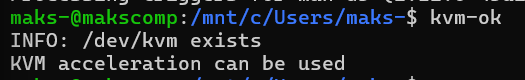

Установили `qemu-kvm`, `libvirt-daemon-system`, `libvirt-clients`, `virt-manager`:

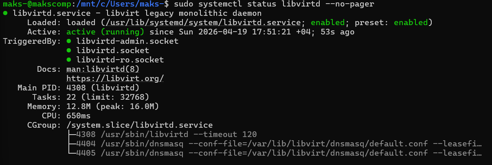

Скачали ISO-образ Ubuntu Server:
```bash
mkdir -p ~/iso ~/vm
cd ~/iso
wget https://releases.ubuntu.com/noble/ubuntu-24.04.4-live-server-amd64.iso
```

Создали системный диск для ВМ (20 ГБ, qcow2):

```bash
qemu-img create -f qcow2 ~/vm/ubuntu-server-lab.qcow2 20G
qemu-img info ~/vm/ubuntu-server-lab.qcow2
```

## Задание 2. Создать гостевую ВМ в KVM
Создали ВМ с параметрами: 2 vCPU, 2 ГБ RAM, virtio-диск, NAT-сеть:

```bash
virt-install \
  --name ubuntu-server-lab \
  --memory 2048 \
  --vcpus 2 \
  --cpu host \
  --disk path=$HOME/vm/ubuntu-server-lab.qcow2,format=qcow2,bus=virtio \
  --cdrom $HOME/iso/ubuntu-24.04.4-live-server-amd64.iso \
  --os-variant ubuntu24.04 \
  --network network=default,model=virtio \
  --graphics vnc,listen=0.0.0.0 \
  --noautoconsole
```

Запустили установку:
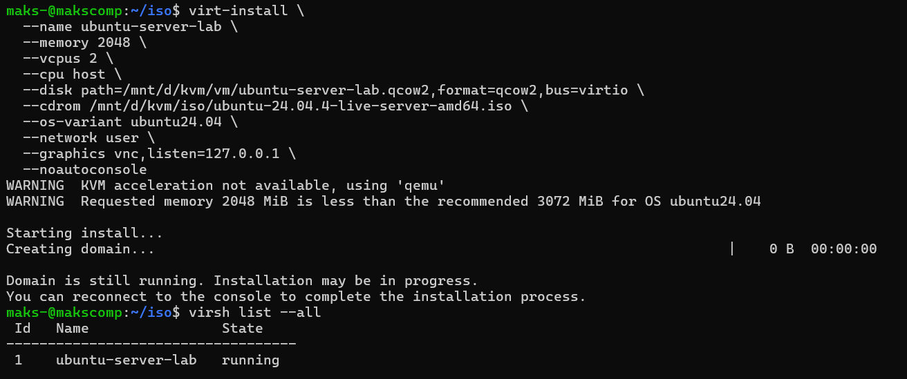

Проверили адрес для подключения:
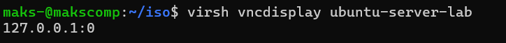

Подключение VNC-клиента:
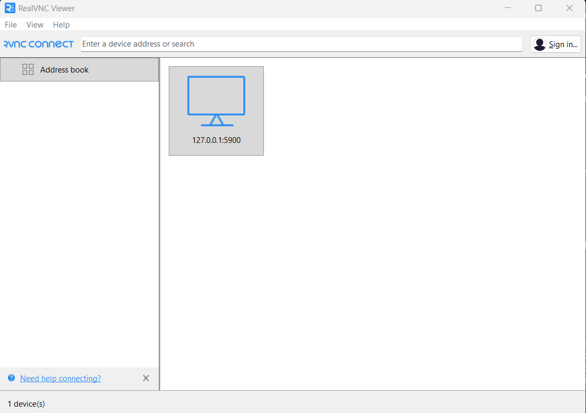
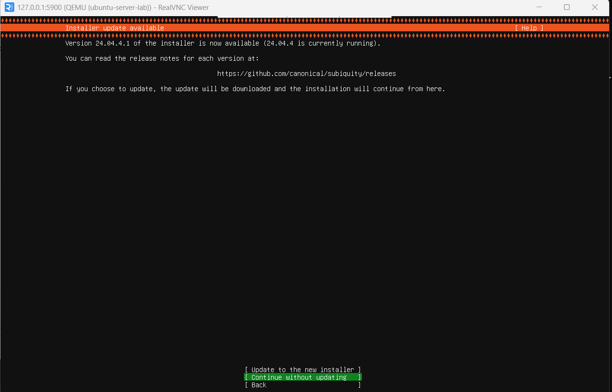

Загрузка Ubuntu:
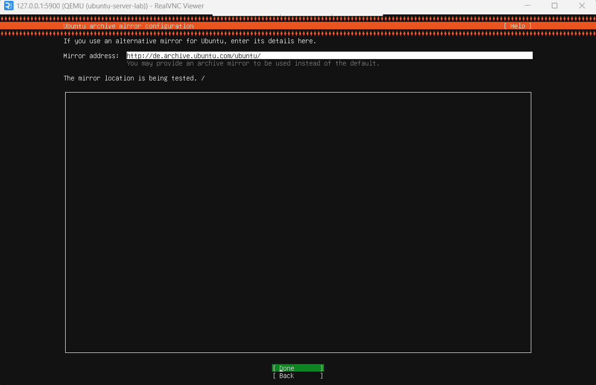
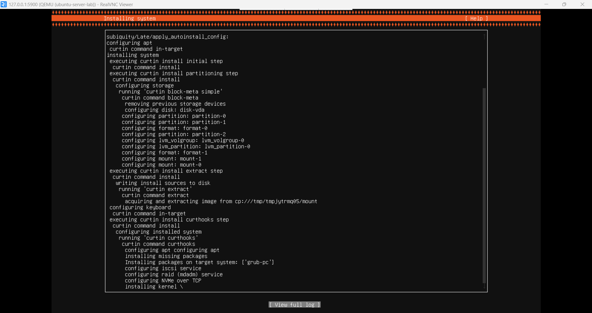

Запустили и вошли под пользователем user:
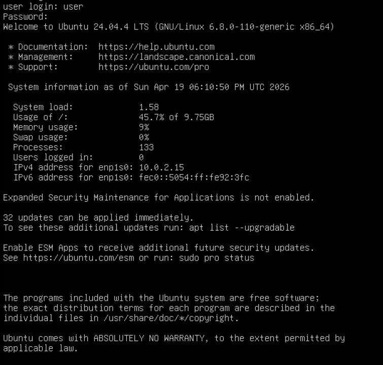

## Задание 3. Сделано при установке

## Задание 4. Настроить SSH по ключу для пользователя user

На хосте (WSL) сгенерировали SSH-ключ:
```bash
ssh-keygen -t ed25519 -C "user@lab"   
```

Скопировали публичный ключ в гостевую ВМ (по паролю):
```bash
ssh-copy-id user@IP_гостевой_ВМ
```

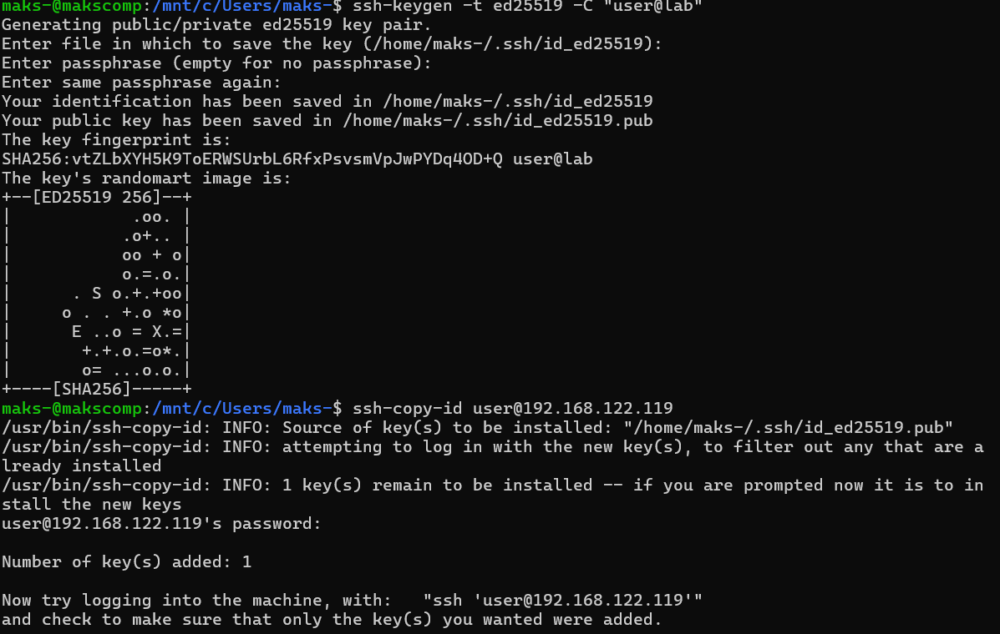

В гостевой ВМ отредактировали /etc/ssh/sshd_config:
```bash
sudo nano /etc/ssh/sshd_config
```

Установили параметры:
```bash
PasswordAuthentication no
PubkeyAuthentication yes
PermitRootLogin prohibit-password
```

Применили изменения:
```bash
sudo systemctl restart ssh
```

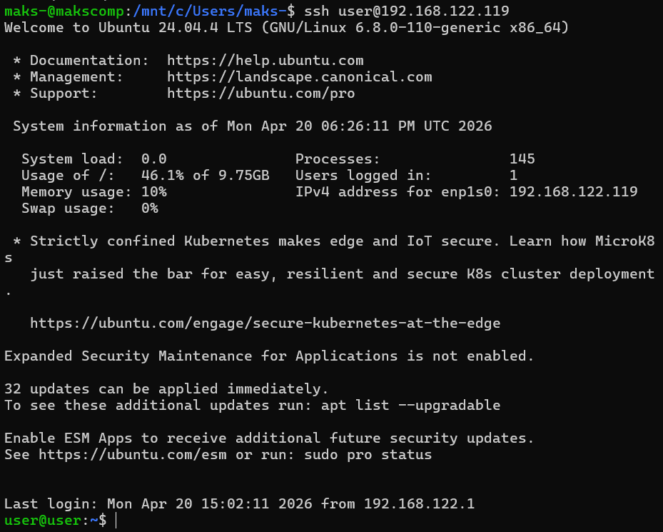

## Задание 5. Изучить конфигурацию гостевой ВМ
Процессор (lscpu)
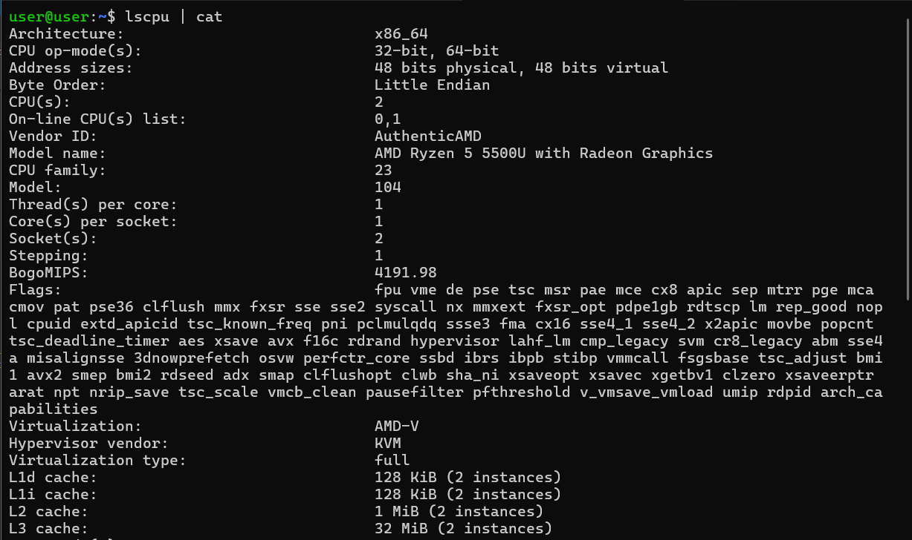

Оперативная память (free -h)
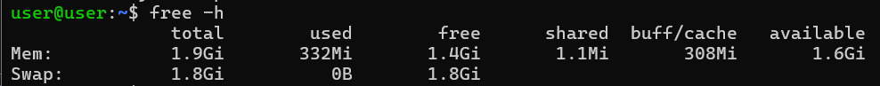

Блочные устройства (lsblk -f)
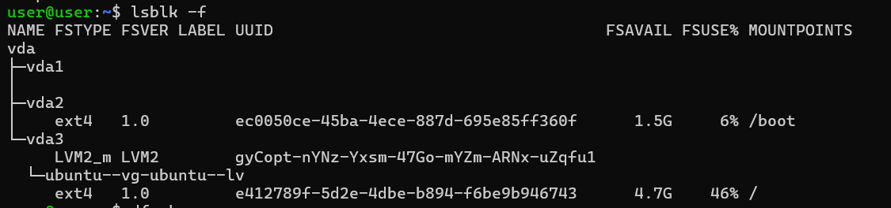

Использование файловой системы (df -h)
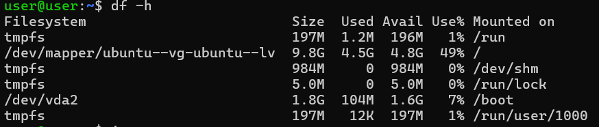

Сетевые интерфейсы (ip a)
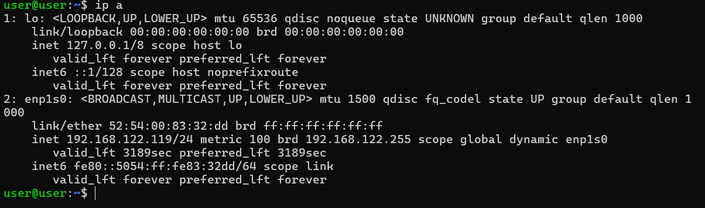

Ресурсы гостевой виртуальной машины

Процессор (CPU):
- 2 виртуальных ядра (vCPU)
- Виртуализация: KVM (full)
- Процессор хоста: AMD Ryzen 5 5500U
- Поддерживается аппаратная виртуализация AMD-V

Оперативная память (RAM):
- Выделено: 1.9 GiB (≈ 2 ГБ)
- Доступно приложениям: около 1.6 GiB
- Swap-раздел: 1.8 GiB

Дисковая подсистема:
- Один виртуальный диск: vda (≈20 ГБ, LVM)
- Корневой раздел (/): 9.8 ГБ, занято 4.5 ГБ (49%)
- Отдельный раздел /boot: 1.8 ГБ

Сетевая подсистема:
- Интерфейс: enp1s0
- MAC-адрес: 52:54:00:83:32:dd
- IP-адрес: 192.168.122.119/24 (получен по DHCP)
- Режим сети: NAT (виртуальная сеть libvirt по умолчанию)

## Задание 6. Пробросить дополнительный диск в гостевую ВМ

Создали RAW-образ диска размером 10 ГБ:

```bash
sudo dd if=/dev/zero of=/mnt/d/kvm/extra-disk.raw bs=1M count=10240 status=progress
```

Подключили RAW-диск как vdb:
```bash
sudo virsh attach-disk ubuntu-server-lab /mnt/d/kvm/extra-disk.raw vdb --targetbus virtio --persistent --driver qemu --subdriver raw
```
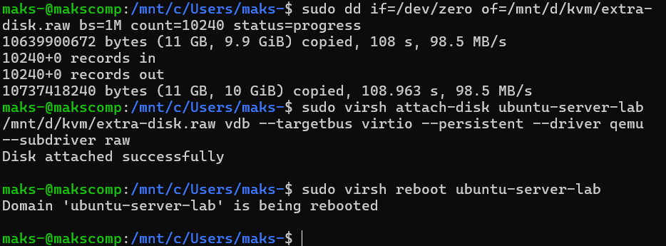

Перезагружаем гостевую ВМ
```bash
sudo virsh reboot ubuntu-server-lab
```

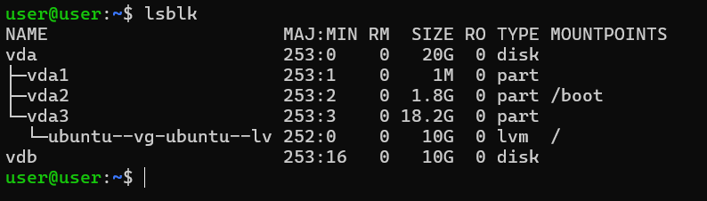

## Задание 7. Создать GPT-разметку, файловую систему ext4 и смонтировать в /disk

Создание GPT-разметки и раздела на весь диск
```bash
sudo parted /dev/vdb mklabel gpt
sudo parted /dev/vdb mkpart primary ext4 0% 100%
```

Проверка появления раздела vdb1
```bash
lsblk
```
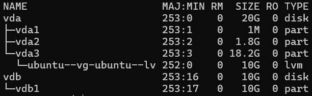

Создание файловой системы ext4
```bash
sudo mkfs.ext4 /dev/vdb1
```

Создание точки монтирования
```bash
sudo mkdir -p /disk
```

Временное монтирование раздела
```bash
sudo mount /dev/vdb1 /disk
```

Добавление записи в /etc/fstab для постоянного монтирования
```bash
echo '/dev/vdb1 /disk ext4 defaults 0 2' | sudo tee -a /etc/fstab
```

Проверка монтирования
```bash
df -h /disk
```
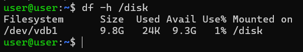

## Задание 8. Обеспечить доступность /disk пользователю user

Проверка исходных прав
После монтирования раздела /dev/vdb1 в /disk владельцем каталога по умолчанию является root
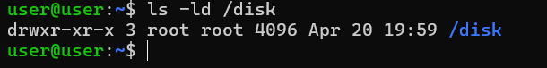

Изменение владельца
```bash
sudo chown user:user /disk
```
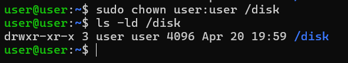

Тестирование доступа от пользователя user
```bash
touch /disk/test-file.txt
echo "Фамилия студента: Иванов" > /disk/test-file.txt
cat /disk/test-file.txt
```
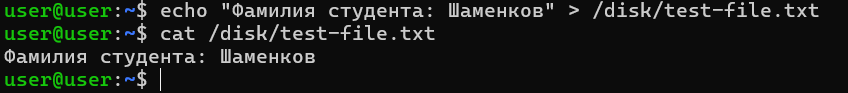

## Задание 9. Установить Docker в гостевой ВМ

Установили Docker из репозитория Ubuntu:
```bash
sudo apt install -y docker.io
```
Запустили и включили автозапуск Docker:
```bash
sudo systemctl enable --now docker
```

Проверка версии Docker:

```bash
docker --version
sudo systemctl status docker --no-pager
```
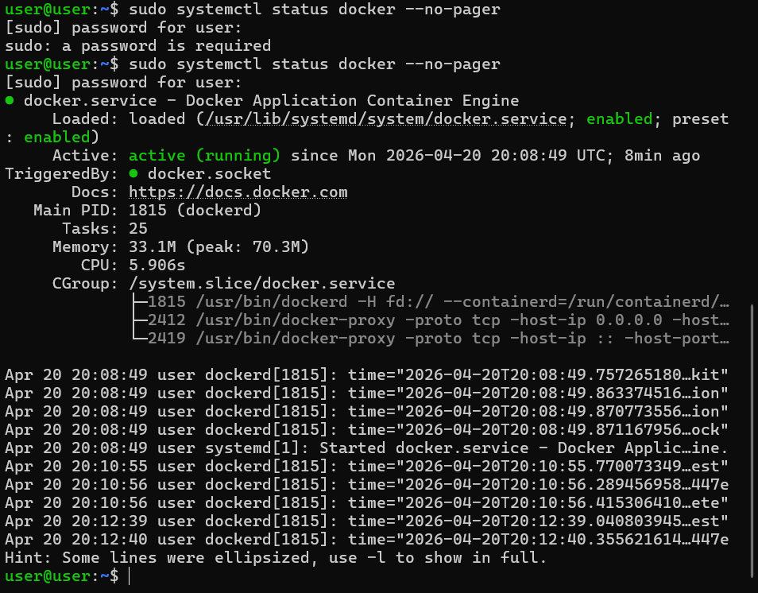

Добавили пользователя user в группу docker:
```bash
sudo usermod -aG docker $USER
```

Проверили работу Docker запуском контейнера hello-world:
```bash
docker run hello-world
```
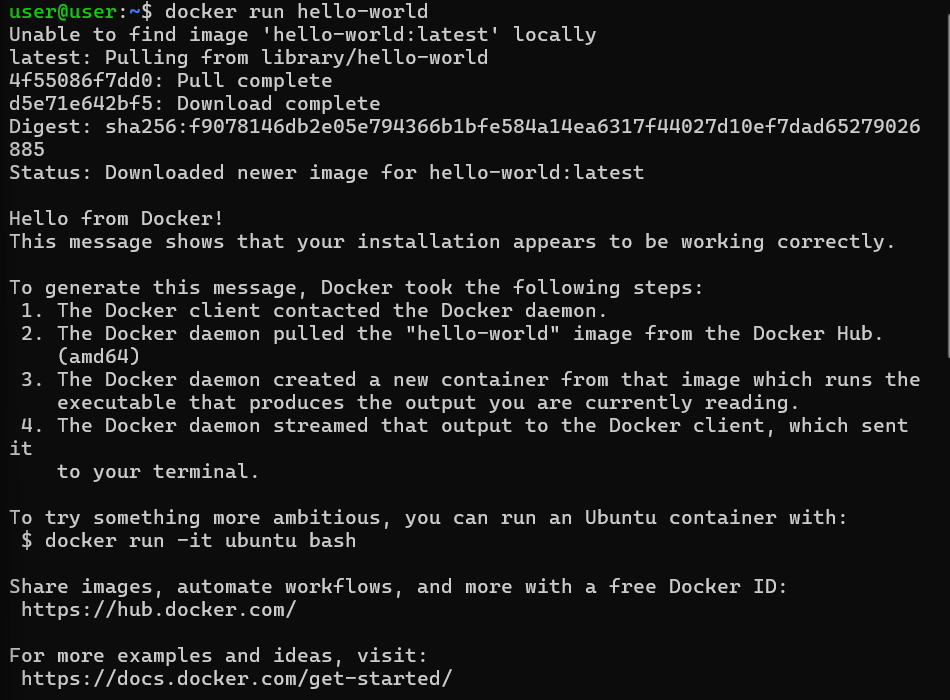


## Задание 9. Развернуть контейнер nginx с выводом фамилии студента


Создали каталог для сайта на диске /disk:
```bash
mkdir -p /disk/nginx-site
```

Создали HTML-файл index.html с фамилией Шаменков:

```bash
cat << EOF | tee /disk/nginx-site/index.html
<!DOCTYPE html>
<html>
<head><title>Лабораторная работа</title></head>
<body>
<h1>Фамилия студента: Шаменков</h1>
<p>Контейнер nginx работает, страница загружена из /disk</p>
</body>
</html>
EOF
```

Запустили контейнер nginx с пробросом порта 80 и монтированием каталога:
```bash
docker run -d --name my-nginx -p 80:80 -v /disk/nginx-site:/usr/share/nginx/html:ro nginx
```
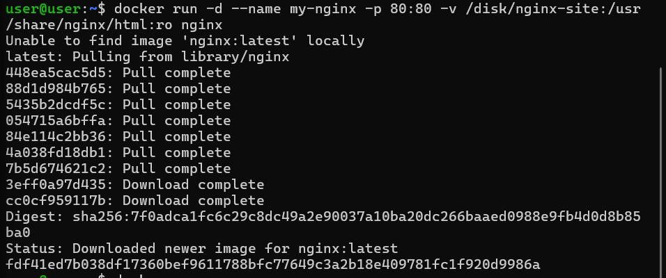


Проверка работающих контейнеров:

```bash
docker ps
```
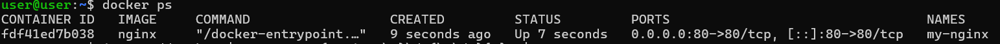

Проверили доступность страницы из WSL (хоста) с помощью curl:
```bash
curl http://192.168.122.119/
```
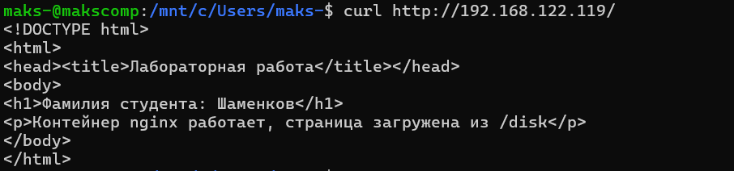

Для просмотра страницы в браузере основной машины создали SSH-туннель из WSL:
```bash
ssh -L 8080:localhost:80 user@192.168.122.119 -N
```

После этого в браузере перешли по адресу http://localhost:8080:
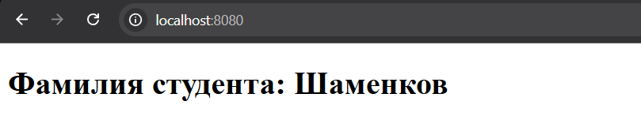