# Отчёт по лабораторной работе №4
**Тема:** DevOps‑автоматизация: systemd, bash‑скрипты и Ansible

**Студент:** Шаменков Максим Александрович, 6413

---

## Задание 1. Подготовить хостовую машину
Начал с подготовки хостовой машины, установив необходимые инструменты и настройки. Для этого были установлены следующие пакеты: git, curl, python3 и python3-venv, ansible
```bash
sudo apt install -y git curl python3 python3-venv ansible
```

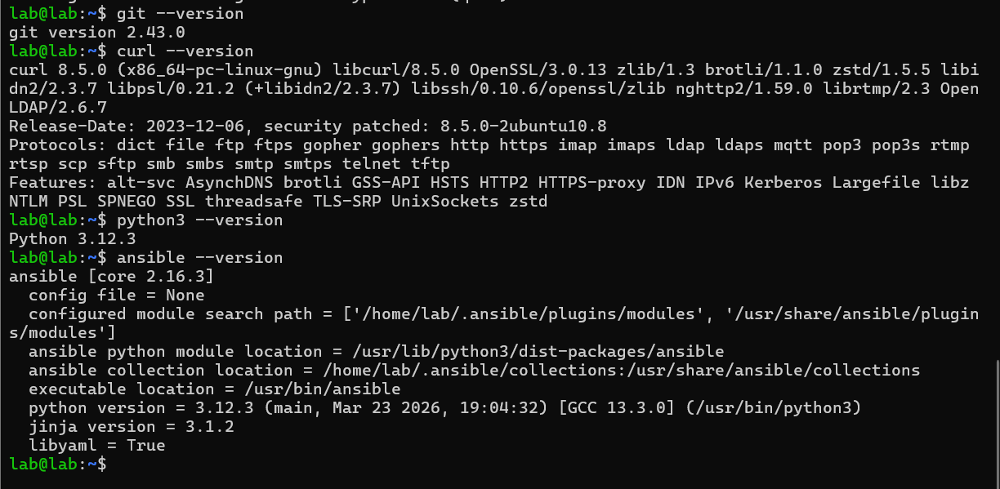

SSH было настроено на прошлых лабораторных работах

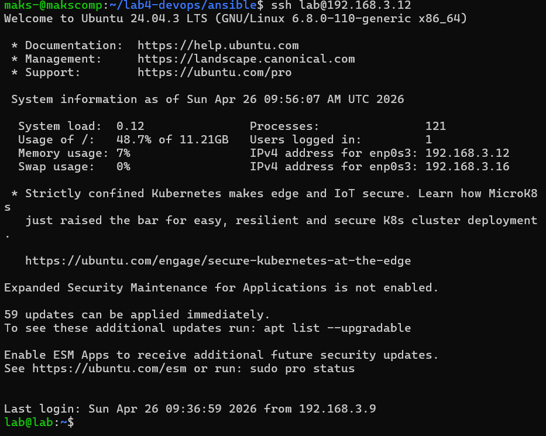

## Задание 2. Bash‑скрипт сервиса
Для развертывания веб-сервиса вы создали каталог /opt/lab4-service/html, в который будет помещен файл index.html. Далее был написан Bash-скрипт service.sh, который:
1) Создает файл index.html с фамилией студента.
2) Запускает простой HTTP-сервер на порту 8000.

Создание каталога для сервиса:
```bash
sudo mkdir -p /opt/lab4-service/html
```
Написание скрипта service.sh:
```bash
sudo nano /opt/lab4-service/service.sh
```
Содержимое service.sh:
```bash
#!/usr/bin/env bash
set -euo pipefail

# Переходим в каталог с html-страницей
cd /opt/lab4-service/html

# Создаем файл index.html с фамилией студента
echo "Shamenkov Maxim" > index.html

# Запускаем HTTP-сервер на порту 8000
python3 -m http.server 8000
```

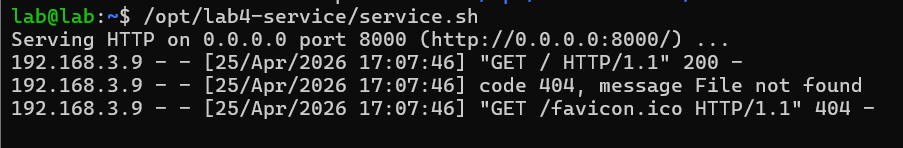


## Задание 3. systemd‑юнит
Далее вы создали unit-файл для systemd, чтобы запустить и управлять сервисом, который будет автоматически запускаться при старте системы.

Команда для создания unit-файла:
```bash
sudo nano /etc/systemd/system/lab4-service.service
```

Содержимое файла lab4-service.service:

```bash
[Unit]
Description=Lab4 Service
After=network.target

[Service]
User=www-data
ExecStart=/opt/lab4-service/service.sh
Restart=always
Environment=PYTHONUNBUFFERED=1

[Install]
WantedBy=multi-user.target
```

Команды для перезагрузки systemd и запуска сервиса:
```bash
sudo systemctl daemon-reload
```

Включение сервиса в автозагрузку и его запуск:
```bash
sudo systemctl enable --now lab4-service
```

Проверка статуса

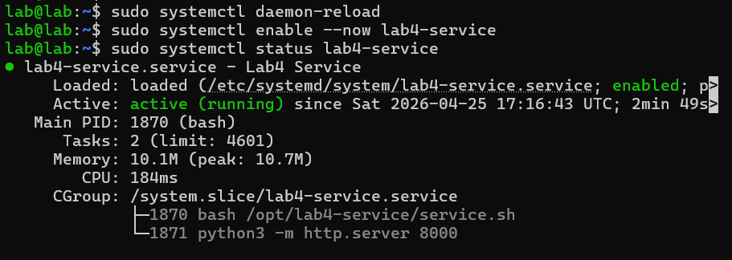

## Задание 4. Логирование и healthcheck

Логирование через journalctl
```bash
sudo journalctl -u lab4-service -n 50
```

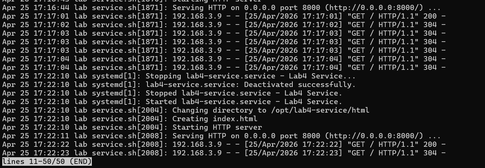

Написание скрипта для healthcheck
Создадим файл lab4-healthcheck.sh в каталоге /usr/local/bin/:

```bash
#!/usr/bin/env bash
if curl --silent --fail http://127.0.0.1:8000/; then
    echo "Service is running successfully!"
else
    echo "Service is down!"
fi
```

Делаем cкрипт исполняемым

```bash
sudo chmod +x /usr/local/bin/lab4-healthcheck.sh
```

Проверка

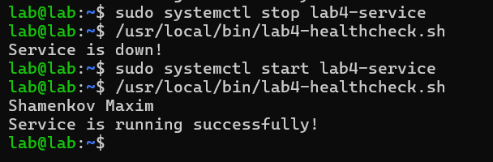

## Задание 5. Git‑репозиторий конфигурациии 
Инициализировали Git-репозиторий.
Создание SSH-ключа:
```bash
ssh-keygen -t rsa -b 4096 -C "maksshamen@gmail.ru.com"
```
Добавление публичного ключа на GitHub:
```bash
cat ~/.ssh/id_rsa.pub
```
Настройка Git для использования SSH:
```bash
git remote set-url origin git@github.com:Maximprogrammer58/lab4-devops.git
```
Коммит и отправка изменений в репозиторий

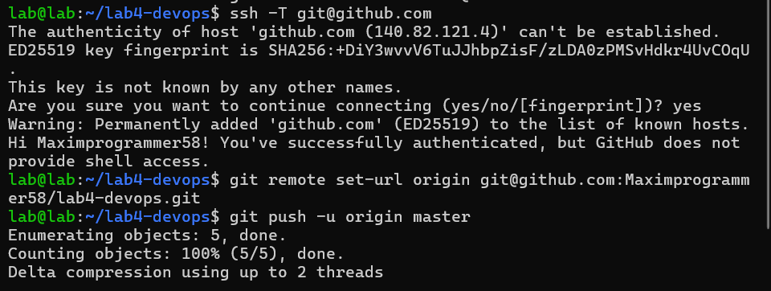

## Задание 6. Ansible‑инвентарь
Создали рабочий инвентарь inventory.ini для Ansible, в котором указали IP-адрес целевой виртуальной машины (VM), пользователя и путь к приватному SSH-ключу. Это позволило Ansible подключаться к VM с использованием SSH-ключа.

Открытие файла на хосте для редактирования:

```bash
nano ~/lab4-devops/inventory.ini
```

Содержимое

```bash
cat > inventory.ini <<EOF
[lab4]
ubuntu-lab4 ansible_host=192.168.3.12 ansible_user=lab ansible_ssh_private_key_file=$HOME/.ssh/id_rsa ansible_python_interpreter=/usr/bin/python3
EOF
```

Проверка подключения через Ansible

```bash
ansible -i ~/lab4-devops/inventory.ini lab4 -m ping
```

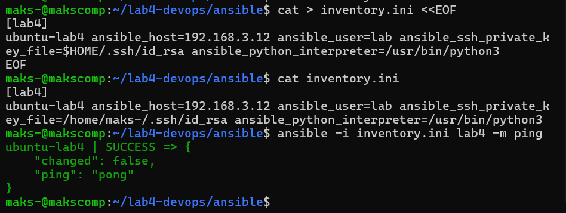

Создание файла для гитхаба без чувствительных данных

```bash
cat > inventory.example.ini <<EOF
[lab4]
ubuntu-lab4 ansible_host=<IP_ADDRESS> ansible_user=<USERNAME> ansible_ssh_private_key_file=<PATH_TO_PRIVATE_KEY> ansible_python_interpreter=/usr/bin/python3
EOF
```
## Задание 7-8. Ansible‑playbook развёртывания сервиса

Создание и запуск playbook site.yml, который:
1) Устанавливает необходимые пакеты.
2) Создает каталог для веб-сервиса.
3) Копирует файлы index.html и service.sh.
4) Создает unit-файл для systemd и запускает сервис.
5) Проверяет доступность сервиса через uri.

```bash
nano ~/lab4-devops/ansible/site.yml
```

Содержимое playbook'а (site.yml):

```bash
---
- name: Развертывание веб-сервиса
  hosts: lab4
  become: yes
  tasks:
    - name: Устанавливаем Apache2 и curl
      apt:
        name:
          - apache2
          - curl
        state: present
    
    - name: Создаем каталог для веб-сервиса
      file:
        path: /opt/lab4-service/html
        state: directory
    
    - name: Копируем файл index.html
      copy:
        content: "Shamenkov Maxim"
        dest: /opt/lab4-service/html/index.html
    
    - name: Копируем файл service.sh
      copy:
        src: files/service.sh
        dest: /opt/lab4-service/service.sh
        mode: '0755'
    
    - name: Создаем unit-файл для systemd
      copy:
        dest: /etc/systemd/system/lab4-service.service
        content: |
          [Unit]
          Description=Lab4 Web Service

          [Service]
          ExecStart=/opt/lab4-service/service.sh

          [Install]
          WantedBy=multi-user.target
    
    - name: Перезагружаем daemon systemd
      systemd:
        daemon_reload: yes
      changed_when: false 
    
    - name: Запускаем сервис
      systemd:
        name: lab4-service
        state: started
        enabled: yes
      changed_when: false
    
    - name: Проверка доступности сервиса
      uri:
        url: http://127.0.0.1:8000/
        status_code: 200
```

Проверка

```bash
ansible-playbook -i inventory.ini site.yml --ask-become-pass
```
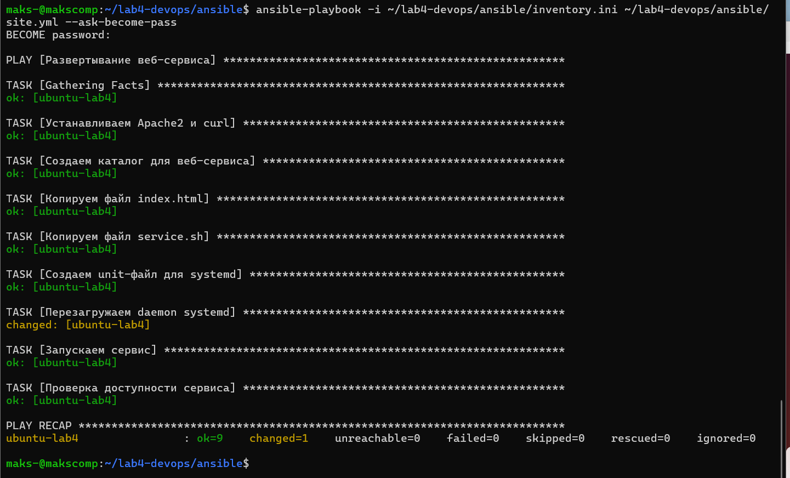

Проверка, что повторный запуск playbook’а идемпотентен (нет неожиданных изменений)

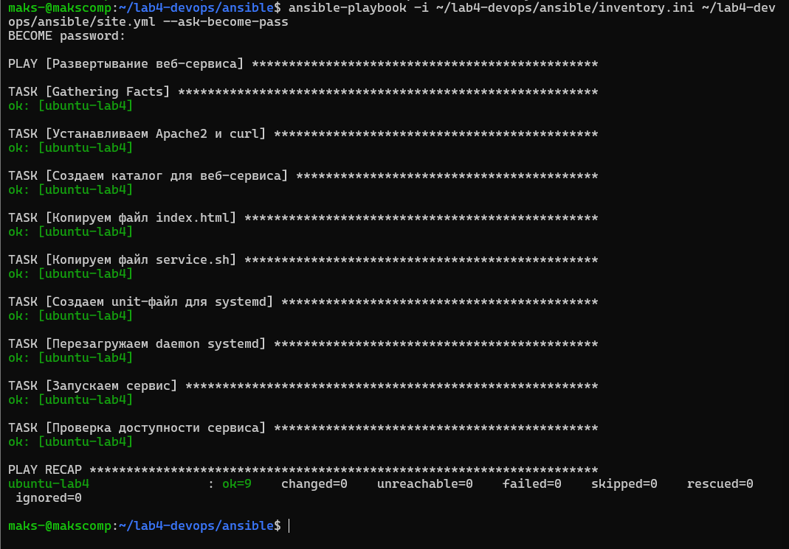

Отправка изменений в GitHub

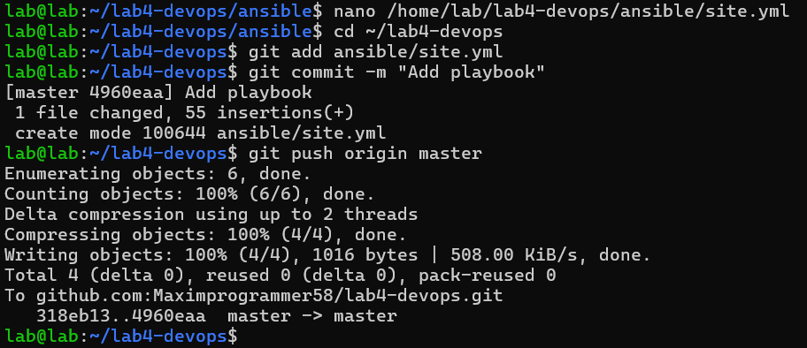
